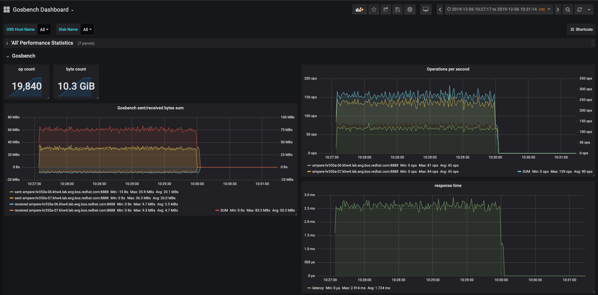

# Gosbench

Gosbench is the Golang reimplementation of [Cosbench](https://github.com/intel-cloud/cosbench).
It is a distributed S3 performance benchmark tool with [Prometheus exporter](https://opencensus.io/exporters/supported-exporters/go/prometheus/) leveraging the official [Golang AWS SDK](https://aws.amazon.com/sdk-for-go/)

## Usage

Gosbench consists of two parts:

* Server: Coordinates Workers and general test queue
* Workers: Actually connect to S3 and perform reading, writing, deleting and listing of objects

INFO: `-d` activates debug logging, `-t` activates trace logging

### Running a test

1. Build the server: `go install github.com/mulbc/gosbench/server`
1. Run the server, specifying a config file: `server -c path/to/config.yaml` - you can find an example config [in the example folder](examples/example_config.yaml)
1. The server will open port 2000 for workers to connect to - make sure this port is not blocked by your firewall!
1. Build the worker: `go install github.com/mulbc/gosbench/worker`
1. Run the worker, specifying the server connection details: `worker -s 192.168.1.1:2000`
1. The worker will immediately connect to the server and will start to get to work.
The worker opens port 8888 for the Prometheus exporter. Please make sure this port is allowed in your firewall and that you added the worker to the Prometheus config.

#### Prometheus configuration

Make sure your prometheus configuration looks similar to this:

```yaml
global:
  scrape_interval:     15s # Set the scrape interval to every 15 seconds. Default is every 1 minute.
  evaluation_interval: 15s # Evaluate rules every 15 seconds. The default is every 1 minute.
scrape_configs:
  - job_name: 'prometheus'
    static_configs:
    - targets:
        - localhost:9090

  - job_name: 'gosbench'
    scrape_interval: 1s
    static_configs:
      - targets:
        - WORKER1.example.com:8888
        - WORKER2.example.com:8888
```

To reload the configuration, you can either send a SIGHUP to your prometheus server or just restart it ;)
Afterwards ensure that you have your Gosbench workers listed at http://your.prometheus.server.example.com:9090/targets

It is expected that the workers are in state `DOWN` most of the time... they are only scrapeable during a test run.

It is Best Practice to run the [Prometheus Node Exporter](https://github.com/prometheus/node_exporter) on all hosts as well, to gather common system metrics during the tests. This will help you in identifying bottlenecks. Please consult the Node Exporter manuals on how to install and configure it on your platform.

### Evaluating a test

During a test, Prometheus will scrape the performance data continuously from the workers.
You can visualize this data in Grafana. To get an overview of what the provided data looks like, check out [the example scrape](examples/example_prom_exporter.log).

There is also an [example Grafana dashboard](examples/grafana_dashboard.json) that you can import and use. The Dashboard has some basic overview of the most common stats that people are interested in:



### Docker

There are now Docker container images available for easy consumption:

```shell
docker pull quay.io/mulbc/goroom-server
docker pull quay.io/mulbc/goroom-worker
```

In the `k8s` folder you will find example files to deploy Gosbench on Openshift and Kubernetes.
Be sure to modify the ConfigMaps in `gosbench.yaml` to use your S3 endpoint credentials.

## Contributing

* Be aware that this repo uses pre-commit hooks - install them via `pre-commit install`
  * [More info](https://pre-commit.com/)
* We are using Go modules in this repository - read up on it [here](https://blog.golang.org/using-go-modules)
* Check out the open [TODOs](TODO.md) for hints on what to work on

## Known issues

* Workers will error out when the config's min value is larger than the max value (even for a constant distribution)
